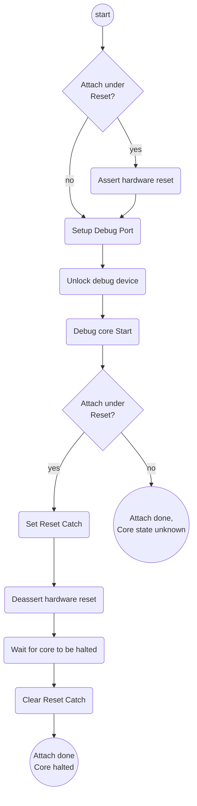

# Target attachment flow

Overview over the steps which happen when
attaching to an ARM target.

```mermaid
flowchart TD
    st((start))
    st --> att{Attach under\n Reset?}
    att -- yes --> reset_assert(Assert hardware reset)
    dp_setup(Setup Debug Port)
    att -- no --> dp_setup
    reset_assert --> dp_setup
    dp_setup --> device_unlock(Unlock debug device)
    device_unlock --> debug_core_start(Debug core Start)
    debug_core_start --> attach_decision_after{Attach under\n Reset?}
    attach_decision_after -- yes --> reset_catch_set(Set Reset Catch)
    reset_catch_set --> reset_deassert(Deassert hardware reset)
    reset_deassert --> wait_core_halted(Wait for core to be halted)
    wait_core_halted --> reset_catch_clear(Clear Reset Catch)
    reset_catch_clear --> attach_done_core_halted((Attach done \n Core halted))
    attach_decision_after -- no --> attach_done_core_unknown((Attach done, \n Core state unknown))
```

